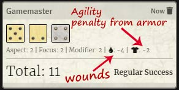
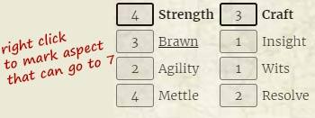
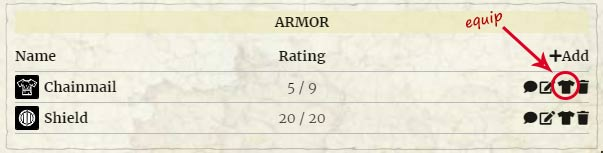
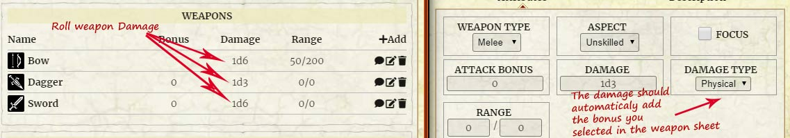
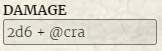
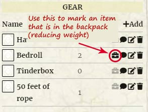

# TALISMAN ADVENTURES

Unofficial Talisman Adventures system for FoundryVTT

## INSTALL

[manifest link](https://raw.githubusercontent.com/superseva/talisman/main/system.json)

## INFO

### Character Types

-   Character (mostly for PC characters)
-   NPC Two tabbed sheet fot NPC-s \
    _Followers are handled as items that you can dragg to character sheets_

### Item Types

-   skills
-   abilities
-   spell
-   weapons
-   armor
-   gear
-   follower
-   enemy attack

## HELP

-   Make a ROLL using the 'Roll' button on top of the character sheet or click on Attributes/Aspect to prepopulate the roll-dialog.
-   Roller will try to add some modifiers like wounds or agility penalty. \
    
-   Mark Aspect you choose to have a cap of 7 by right clicking on it. \
    
-   Equip armor to get the armor plaque on the Character Sheet. \
    
    
-   Weapon Damage can be rolled from weapon list. It adds hte bonus you selected in the weapon sheet. \
    
-   You can use @cra to add bonus damage for spells. \
    
-   You can simulate item being in the backpack by clicking the 'packed' icon in the list. A formula for item weight when calculating encumbrance is Math.ceil(weight/2) \* quantity. \
    
